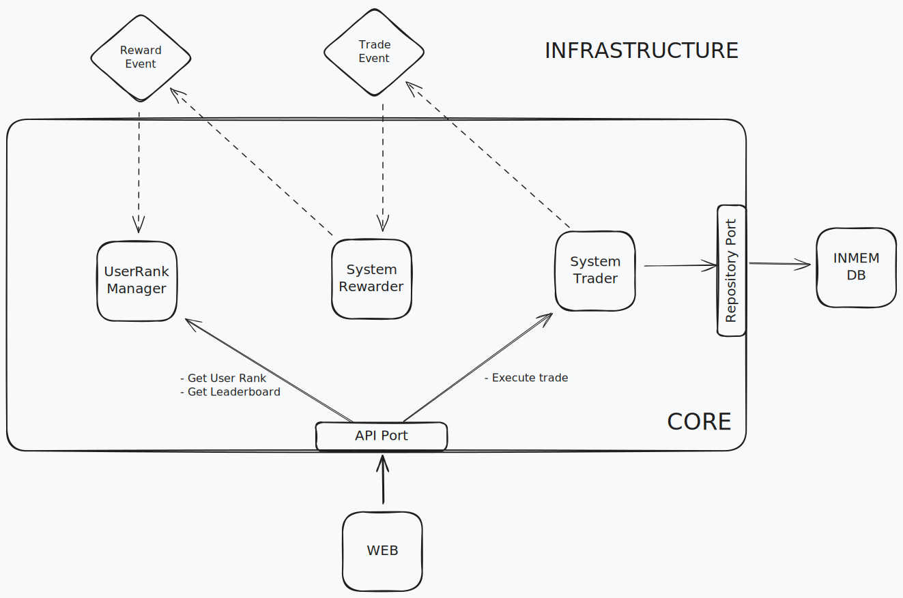

# Tradesys

Tradsys is a program that simulates a gamified trading feature for an investment app and allow users to:
- Add new assets.
- Simulate trading of assets (buy/sell).
- Earn gems based on trading activities.
- Follow a ranking system that tracks users with the highest gem count.

## Rewards System

### Base Rewards
- 1 gem per trade (buy or sell)

### Milestone Bonuses
- 5 bonus gems at 5 trades
- 10 bonus gems at 10 trades
- Bonus gems of trade count at every 20 trades thereafter (20, 40, etc.)

### Streak Bonuses
- 3 gems for every consecutive 3 trades, reset if trade is performed by another user
- Bonus gems equal to streak count when streak ≥ 7

## Running the Application
This application is built using Spring Boot 3.5.0 and java 24.

```sh
# Clone the repository
git clone https://github.com/TPriime/tradesys.git

# Navigate to project directory
cd tradesys

# Run the application
./gradlew src:infrastructure:bootRun
```
The application should now be available at:
http://localhost:8080

Asset simulation rate can be updated by setting the env variable `SIMULATION_ASSET_CHANGE_SECS`.
For example the following would make asset values to change every 10 seconds (default):
```
export SIMULATION_ASSET_CHANGE_SECS=10
./gradlew src:infrastructure:bootRun
```

## 📌 **API Endpoints**
| Method | Endpoint                      | Description             |
|--------|-------------------------------|-------------------------|
| `GET`  | `/api/assets`                 | Fetch all assets        |
| `GET`  | `/api/trades`                 | Fetch trades all trades |
| `GET`  | `/api/trades?userId={userId}` | Fetch trades by user    |
| `GET`  | `/api/users`                  | Fetch all uers          |
| `GET`  | `/api/users/{userId}`         | Fetch a user            |
| `GET`  | `/api/users/leaderboard`      | Fetch top ranking users |
| `GET`  | `/api/users/1/stats`          | Fetch user stats        |
| `POST` | `/api/trades/buy`             | Perform trade           |
| `POST` | `/api/users`                  | Create a user           |

## Common POST Request Examples

### Create User
Creates a user with an initial fund of 1000.00 units for trading activities.

POST /api/users
```json
{
    "username": "username"
}
```

### Execute Trade

POST /api/trade
```json
{
  "userId": 1,
  "assetId": 1,
  "quantity": "2.65"
}
```

## Design Decisions

This project follows the Hexagonal architecture design style. Hexagonal Architecture separates core business logic from external systems by using interfaces (ports) and implementations (adapters). This promotes flexibility, testability, and clean code boundaries.

### Structure
```sh
.
└── src
    ├─── domain
    │   └── src/main/java/com/agbafune/tradesys
    │       ├── api
    │       ├── event
    │       ├── exception
    │       ├── model
    │       ├── repository
    │       └── simulator
    └── spring
        └── src/main/java/com/agbafune/tradesys
            ├── event
            ├── repository
            └── web
```

- [**domain**](./src/domain) implements the *core* business logic of the system. It defines both inbounds and outbound *ports* to be implemented by the infrastructure.
    - [**api**](./src/domain/src/main/java/com/agbafune/tradesys/api/) defines *outbound ports* i.e interfaces consumed by the infrastructure.
    - [**event**](./src/domain/src/main/java/com/agbafune/tradesys/event/) defines the two major events [`TradeEvent`](./src/domain/src/main/java/com/agbafune/tradesys/event/TradeEvent.java) and [`UserRewardedEvent`](./src/domain/src/main/java/com/agbafune/tradesys/event/UserRewardedEvent.java). It also defines *inbound ports* — interfaces consumed by the core.
    - [**model**](./src/domain/src/main/java/com/agbafune/tradesys/model/) defines the domain models.
    - [**repository**](./src/domain/src/main/java/com/agbafune/tradesys/repository/) defines repositories as *inbound ports*. The infrastruce implements these interfaces to provide a datastore for the application.
    - [**simulator**](./src/domain/src/main/java/com/agbafune/tradesys/simulator/) contains an [`AssetSimulator`](./src/domain/src/main/java/com/agbafune/tradesys/simulator/AssetSimulator.java) that simulates live changes in asset prices. It updates the prices of all assets in the system.
- [**spring**](./src/spring/) is implementation of the infrastructure based on [Spring boot](https://spring.io/projects/spring-boot/). It contains the infrastructure code — defines the actual respositories and provides a web interface for interacting with the system. 
   - [**event**](./src/infrastructure/src/main/java/com/agbafune/tradesys/event/) defines *adapters* which are concrete implementations of the event *ports* in the core.
   - [**repository**](./src/infrastructure/src/main/java/com/agbafune/tradesys/repository/) defines *adapters* which are concrete implementations of the repository *ports* in the core. In this case — an in-memory database. (Moved to [inmemdb](./src/inmemdb/))
   - [**web**](./src/infrastructure/src/main/java/com/agbafune/tradesys/web/) provides a spring based web interface, APIs for interacting with the system.

---

### 🏅 Ranking Logic



#### 🏅 UserRankManager

[`UserRankManager`](./src/domain/src/main/java/com/agbafune/tradesys/UserRankManager.java) is a service that tracks user rankings based on the number of "gems" they've earned. It reacts to reward events and dynamically maintains an in-memory ranking system with efficient concurrent updates and lookups. It optimises for efficient rank retrieval under high concurrency writes.

- Rank = (Number of users with higher gems) + 1

#### 📦 Responsibilities

- Listens for `UserRewardedEvent` and updates a user’s gem value.
- Maintains fast lookup for:
  - A user’s current rank.
  - The top N ranked users.
- Ensures thread safety using `ReadWriteLock` and concurrent collections.


#### 🧠 How It Works

- `userGemValue`: Maps each user ID to their current gem count.
- `gemValueCounts`: Tracks how many users have each gem count (sorted), using a `ConcurrentSkipListMap`.
- `updateRank(...)`: Adjusts gem values and maintains totals.
- `getRank(...)`: Calculates a user's rank by counting how many users have *more* gems.
- `getTopRankedUsers(topN)`: Retrieves the top N users, assigning equal rank to those with equal gem values.


#### 🔁 Event Integration

`UserRankManager` subscribes to `AppEventListener` and reacts when a user is rewarded:

```java
eventListener.onUserRewardedEvent(event -> {
    updateRank(event.userId(), event.userGems());
});
```

---

#### 🚀 Scalability & Tolerance

- Read-write operations on rank data are protected by `ReentrantReadWriteLock` for consistency in a concurrent environment.
- Efficient use of `ConcurrentSkipListMap` for ordered rankings.
- Use of `LongAdder` avoids contention when incrementing counts and scales well in concurrent write heavy environments (unlike AtomicLong).
- Clean separation of responsibilities through `UserRankAccessor` interface.


#### ⚠️ Trade-offs & Limitations

- `LongAdder` is more optimized for heavy write environments and where the total sum is retrieved less, sacrificing exact snapshot accuracy for eventual consistency. Therefore if the leaderboard report is much frequently requested under heavy writes, the results may not be up to date.
- **Memory-bound scalability** All user rank data is stored in-memory using ConcurrentHashMap and ConcurrentSkipListMap. As the user base grows, memory usage could spike, especially for long-lived services.
- **Real-time accuracy trade-offs** Since rankings depend on current gem counts, any delay in event delivery (e.g. missed or late UserRewardedEvent) can skew results.


### 🔧 Extensibility

Modular, clean design with Hexagonal architecture makes it easy to build untop of different infrastructures without touching the core business logic. See an exmaple with using [Vert.x](https://vertx.io/)

## Future Improvements
* Enable users manage multiple portfolios.
* If real time leaderboard data can be ignored, implementing a cache would improve performance.